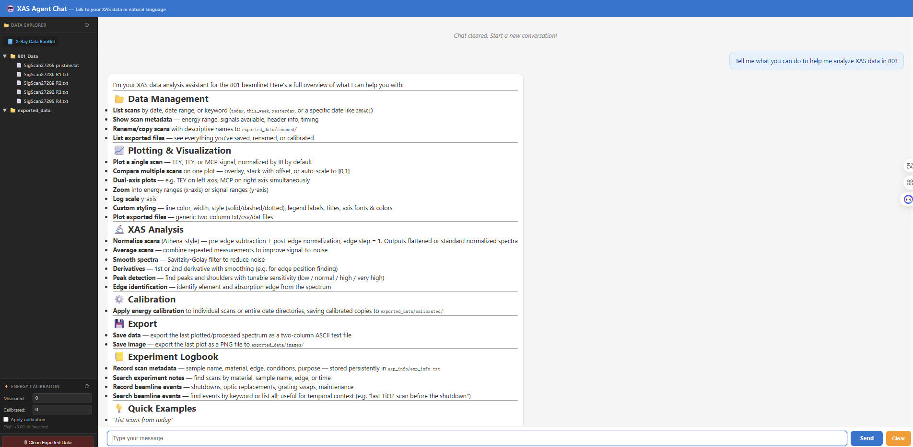
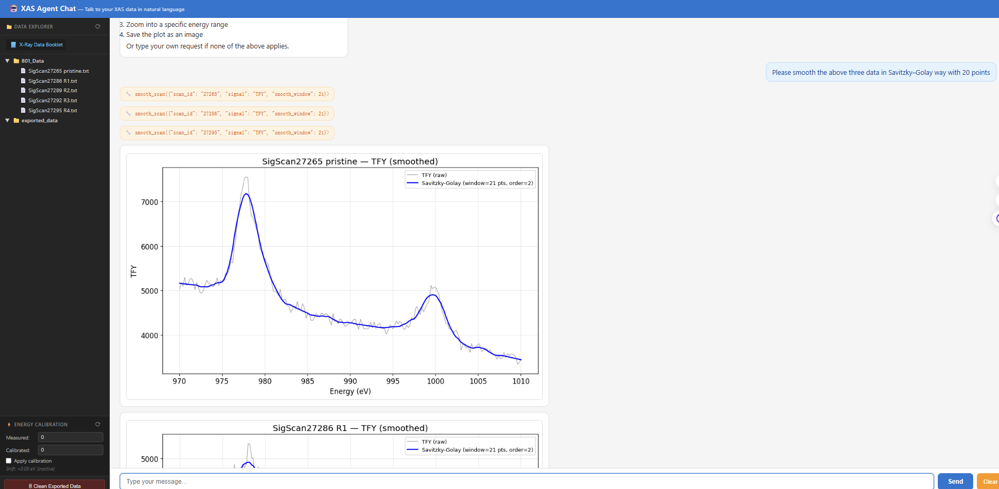
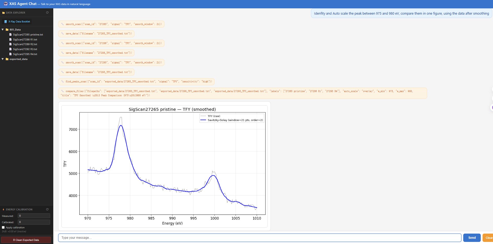
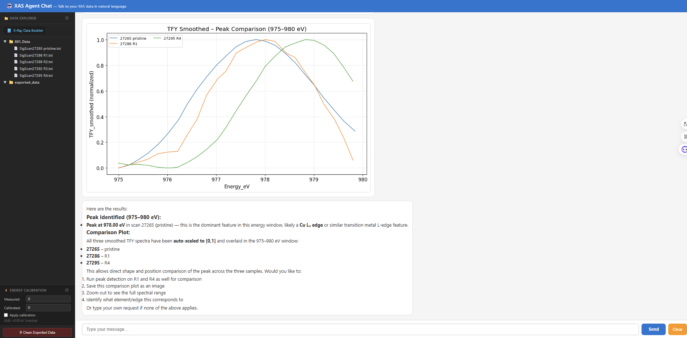

# Demo & Walkthrough

A short tour of the XAS AI Agent in action. Every result below was produced by typing a
plain-English request into the chat — the agent chose and ran the analysis tools itself.

> The screenshots reference images in this folder. Keep `DEMO.md` and the five PNGs
> (`demo_overview.png`, `demo_plot_.png`, `demo_smoothing.png`, `demo_peaks_1.png`,
> `demo_peaks_2.png`) together (e.g. in a `docs/` folder).

---

## 1. Ask what it can do

> **Prompt:** *"Tell me what you can do to help me analyze XAS data in 801"*

The agent summarizes its full capability set — data management, plotting, XAS analysis,
calibration, export, and the persistent experiment logbook.



---

## 2. Plot and compare several scans

> **Prompt:** *"Please plot the TFY data of 27265, 27286 and 27295 together"*

From the bare scan numbers, the agent locates each file, divides TFY by I0, and overlays
the three spectra on one axis. Note that each curve is labeled with the **full sample name**
(`SigScan27265 pristine`, `SigScan27286 R1`, `SigScan27295 R4`) — scans are found by number
even though the files were renamed with descriptive suffixes.

`compare_scans({"scan_ids": ["27265", "27286", "27295"], "signal": "TFY"})`


---

## 3. Smooth the spectra (Savitzky–Golay)

> **Prompt:** *"Please smooth the above three data in Savitzky–Golay way with 20 points"*

The agent calls the smoothing tool once per scan and overlays each raw curve with its
smoothed version. The Savitzky–Golay window must be odd, so the agent uses a valid window
(21 points, polynomial order 2) — shown in the legend.

`smooth_scan({"scan_id": "27265", "signal": "TFY", "smooth_window": 21})`  *(×3)*



---

## 4. Identify and compare a peak — a multi-step chain from one sentence

> **Prompt:** *"Identify and auto-scale the peak between 975 and 980 eV, compare them in one
> figure, using the data after smoothing"*

This single request triggers a chain of tool calls: smooth each scan → save each smoothed
trace to `exported_data/` → run peak detection on the smoothed data → overlay all three,
auto-scaled to [0, 1] and zoomed to 975–980 eV for a direct shape/position comparison.

```
smooth_scan ×3  →  save_data ×3  →  find_peaks_scan  →  compare_files (auto_scale, e_min 975, e_max 980)
```





The agent locates the dominant peak (~978 eV) and overlays the normalized peaks so their
positions and shapes can be compared across the three samples. *(Any element/edge assignment
the agent suggests should be confirmed against reference energies — see note in the README.)*

---

## How it works / Architecture

The app is a thin Flask server wrapping an LLM **tool-calling loop**. The model never touches
raw files directly; it requests typed tool calls, the server runs them against the data, and
the results (including plots) are fed back so the model can decide the next step or answer.

```
User ↔ Browser (chat UI)
       │  POST /chat
       ▼
   Flask server (chat_app.py)
       │  OpenAI-compatible API, tools=[...]
       ▼
   LLM  ──chooses tool(s)──▶  TOOL_DISPATCH
                                  │
              ┌───────────────────┼────────────────────┐
              ▼                   ▼                     ▼
        xas_utils.py        plotting (Matplotlib)   exp_info.py
   (parse / normalize /     → base64 PNG inline      (persistent
    smooth / derivative /                              scan notes)
    peaks / edge ID)
              │                                         │
              ▼                                         ▼
        801_Data/*.txt                          exp_info/exp_info.txt
```

The loop, step by step:

1. The user's message is sent to the LLM together with the list of available tools (their
   names, descriptions, and JSON parameter schemas).
2. The LLM returns one or more **tool calls** with arguments (e.g.
   `smooth_scan(scan_id="27265", signal="TFY", smooth_window=21)`).
3. The server executes each call: `xas_utils` loads and processes the data, Matplotlib renders
   a figure, and it is returned as a base64-encoded image plus a short text result.
4. Results are appended to the conversation and sent back to the LLM, which either issues
   **more** tool calls or writes the final natural-language answer.
5. Plots stream into the chat inline; the last plotted data/image is cached so follow-ups like
   *"save that"* work without re-running the analysis.

**What the demos illustrate about the design**

- *Demo 2* shows the robust file layer: a scan is resolved by its unique number even after
  renaming, and the descriptive filename is carried through to plot labels.
- *Demo 3* shows the agent producing **valid tool parameters** (an odd Savitzky–Golay window)
  rather than passing the request through verbatim.
- *Demo 4* shows genuine **agentic planning**: one sentence expands into a coordinated
  smooth → save → detect → compare pipeline, with intermediate artifacts written to disk and
  reused downstream.
